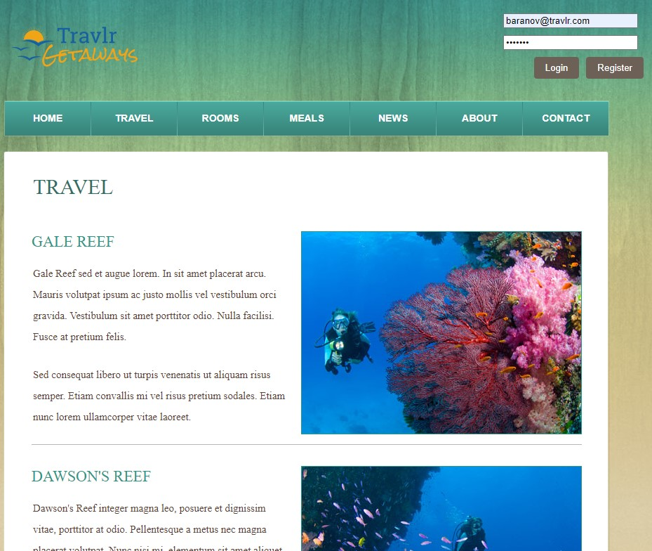
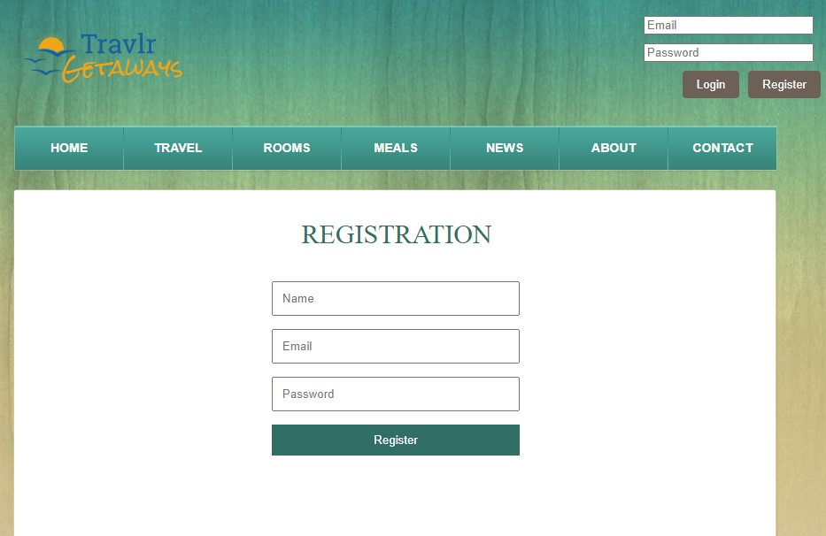
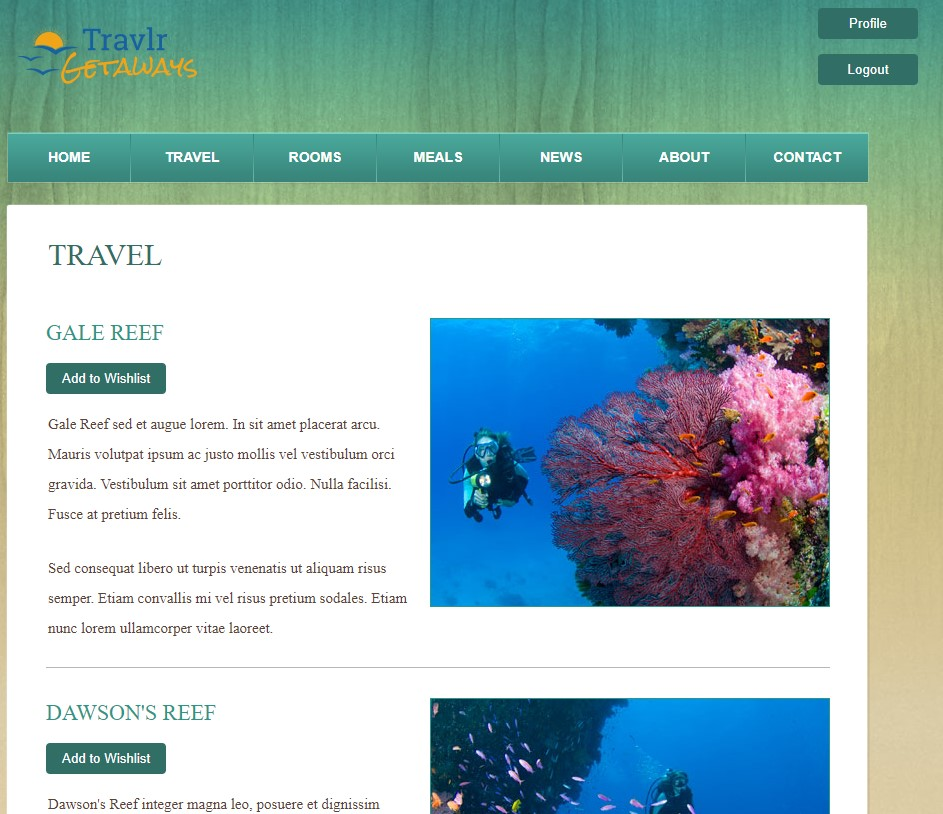
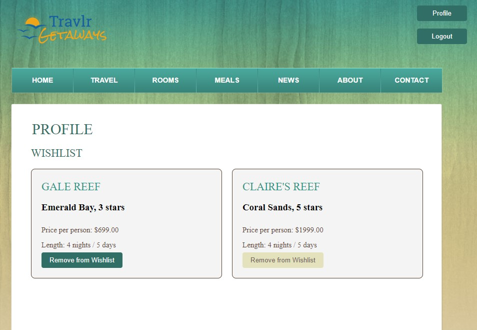

# CS-465 Full Stack Development with MEAN
# Travlr App

This application consists of an Express website that displays trip packages that are stored in the MongoDB database. The database was designed to store user information, and trip packages. A Passport.js local strategy is used to authenticate users. The admin back end for the application is built with Angular as a single-page application from which admin users can add, edit, and delete trips to the database and consequently the Express website. To tie all of this together, we use a Node server to respond to API requests.  

Most of this application was developed in the CS-465 Full Stack Development I course at SNHU. To enhance this application and to demonstrate my skills, I continued to fill out the functionality of the application. The items added so far are listed below.  

1. Login, logout, and registration for Travlr clients
    - Separated admin login and admin registration for SPA
    - Added login form in header with conditional rendering to show profile and logout buttons when signed in
    - Added registration page to add client users
2. Migrated database to add fields for users
    - Added boolean field to check for admin
    - Added wishlist array field to hold references to trips documents
3. User Profile for Travlr clients
    - Added profile page to show user information, right now only a wishlist
4. Wishlists for Travlr clients
    - Added API method to get wishlists for rendering on user profile page
    - Added API method to add and delete trips from a user's wishlist
    - Included conditional rendering for "Add to wishlist" button when logged out

## Conditional Rendering  

When the user is logged out they will see the login component in the header of every page on the Express site.

If they have not registered, they can click on the "Register" button to be redirected to the registration page.

## Registration Page  

Once they have registered, they will be logged in and can see the logged-in components, the profile button, the logout button, and the profile page.

## Logged In Travel Page  

On the travel page, there are now "Add to Wishlist" buttons that will add the trip to a wishlist array in the user database.

When added, it will redirect the user to the homepage to see their updated profile which is only composed of the wishlist.

## Wishlist

The wishlist is a grid composed of the trips that the user has wishlisted. Each card has the resort information, the price, and the length of stay. At the bottom, the user can press the "Remove from Wishlist" button to send a DELETE request to the database to delete the trip from the wishlist array.